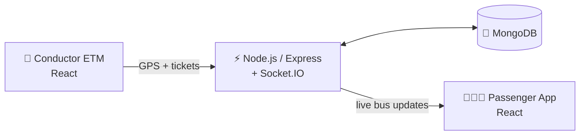

<div align="center">


<br/>

<a href="https://github.com/vickyvic07">
  
</a>

<br/>

<a href="https://www.linkedin.com/in/vignesh-r-1b18b0263/"></a>
<a href="https://leetcode.com/u/Vignesh178/"></a>
<a href="mailto:vicktvicky101@gmail.com"></a>


</div>

<br/>

## 🏁 Pit Wall Briefing

> *"Some people watch races. I build systems."*

Hey, I'm **Vignesh R** 👋 — a **final-year B.Tech Information Technology student** and aspiring **Software Developer** from Tamil Nadu, India.

I'm drawn to systems that *move*: buses that broadcast their live location and seat availability, civic complaints that are tracked from the first report to the final fix, and microservices that stay fast even when the network doesn't. I start from a real-world problem, build it end-to-end (UI → API → database → real-time layer), and keep iterating until it's solid.

My workflow is the same loop every time: **Code → Create → Deploy → Repeat.**

```java
public class Vignesh {

    String  role        = "Software Developer | B.Tech IT (2023 – 2027)";
    String  homeBase    = "Java";
    String[] buildsWith = {"React", "Node.js", "Next.js", "MongoDB", "MySQL"};
    String[] exploring  = {"Kotlin", "Spring Boot", "TypeScript", "Machine Learning"};
    String  practice    = "LeetCode — 200+ commits of solutions";
    String  mindset     = "Learn. Build. Improve. Grow.";
    boolean openToWork  = true;   // internships & entry-level software roles

    public void run() {
        while (true) { code(); create(); deploy(); repeat(); }
    }
}
```

<br/>

## 🧭 Race Strategy

<table align="center">
  <tr>
    <td align="center" width="25%"><h3>♾️ LEARN</h3>Java-first fundamentals, plus certifications from NPTEL and Infosys Springboard.</td>
    <td align="center" width="25%"><h3>💻 BUILD</h3>Full-stack projects: real-time bus tracking, a civic issue platform, and a Kotlin microservice.</td>
    <td align="center" width="25%"><h3>🚀 IMPROVE</h3>Daily problem-solving on LeetCode; sharper code, cleaner structure, better design.</td>
    <td align="center" width="25%"><h3>📊 GROW</h3>Expanding into Spring Boot, TypeScript and machine learning.</td>
  </tr>
</table>

<br/>

## 🛠️ The Garage

**Core — my daily drivers**


**Built projects with**

 &nbsp;

**Exploring next**


<br/>

## 🏎️ Grid Lineup — Featured Projects

### 🚌 SmartBus — Real-time Bus Ticketing & Tracking System
[](https://github.com/vickyvic07/Miniproject)


A two-sided platform for public transport, built around the idea of *Smart Ticketing and Seat Monitoring*: a **Conductor ETM** (electronic ticketing machine) and a **Passenger Tracking App**, linked by a WebSocket backend so every update lands instantly.

- 📡 **Live GPS broadcasting** — passengers see exactly where the bus is on the map
- 🎫 **Digital ticketing** for adults and children
- 📍 **Smart geofencing** — passenger count drops automatically when the bus reaches a stop
- 💺 **Live seat availability** and route-based bus search
- 🔔 **Instant notifications** for bus arrivals and ticket updates



<br/>

### 🏙️ Civic Issue Reporting System
[](https://github.com/vickyvic07/civic_issue_reporting)


A crowdsourced platform where citizens report and track issues like potholes and broken streetlights.

- 📝 Submit an issue with a title, description, location and photos
- 📋 Browse every reported issue in one place
- 🛡️ Admin panel to review and update issue statuses

<br/>

### 🔢 Number Management Service
[](https://github.com/vickyvic07/NumberManagementSystem)


A Kotlin **Spring Boot microservice** that accepts multiple URL query parameters, fetches JSON from each valid remote endpoint, merges all the integers, removes duplicates, sorts them in ascending order, and returns the result quickly — **ignoring invalid or slow URLs** so one bad source never stalls the response.

<br/>

### 🩺 Diabetes Prediction with Logistic Regression
[](https://github.com/vickyvic07/Diabetes-)


A machine learning walkthrough on the Pima Indians diabetes dataset: loading data, visualising it, training a logistic regression model and evaluating it (about **77% accuracy** in the sample run).

<br/>

## 🧩 Lap Times — Problem Solving

I keep my problem-solving sharp with regular practice on LeetCode, and every solution is committed to my [**Leetcode**](https://github.com/vickyvic07/Leetcode) repo in **Java** — **223 commits** and counting.

<div align="center">
  <a href="https://leetcode.com/u/Vignesh178/">
    
  </a>
</div>

<details>
<summary><b>🔍 Topics I've practised</b></summary>
<br/>

| Area | Examples from my solutions |
|---|---|
| Arrays & hashing | Group Anagrams, Top K Frequent Elements, Longest Consecutive Sequence |
| Sliding window & two pointers | Longest Substring Without Repeating Characters, Minimum Size Subarray Sum, Permutation in String |
| Linked lists | Linked List Cycle, Merge Two Sorted Lists, Remove Nth Node From End |
| Backtracking | N-Queens, Combinations |
| Greedy & DP-style thinking | Jump Game, Candy, Maximum Subarray, Trapping Rain Water |
| Stacks, queues & design | Implement Queue Using Stacks |
| Bit manipulation | Minimum Bit Flips, Prefix XOR problems |
| SQL | Nth Highest Salary, Customers Who Never Order, Rising Temperature |

</details>

<br/>

## 📈 Telemetry

<div align="center">
  
  
  <br/>
  
  <br/>
  
</div>

<br/>

## 🎓 Career Timeline & Credentials

| Year | Milestone |
|---|---|
| **2022 – 2023** | **HSC (State Board)** — SriVidhya Nikethan Matric Higher Secondary School, Kangayam · **88.3%** |
| **2023 – 2027** | **B.Tech, Information Technology** — V S B Engineering College, Kangeyam |
| **Certified** | **NPTEL** — Programming in Java (Bronze) |
| **Certified** | **Infosys Springboard** — Java Foundation Certification |
| **Certified** | **Infosys Springboard** — Python Foundation Certification |

🗣️ **Languages I speak:** Tamil · English · Kannada

<br/>

## 🎯 Current Lap

- 🔭 Building full-stack projects with the **MERN-style stack** and **Next.js + TypeScript**
- 🌱 Learning **Kotlin & Spring Boot** by building microservices
- 🧮 Solving **LeetCode** problems in Java to sharpen data structures and algorithms
- 🤝 **Open to** internships and entry-level Software Developer roles where I can apply what I've learned, keep growing, and contribute to innovative software

<br/>

## 📬 Radio Check — Let's Connect

Have an idea, an opening, or just want to talk code? My inbox is open.

<div align="center">

<a href="https://www.linkedin.com/in/vignesh-r-1b18b0263/"></a>
<a href="mailto:vicktvicky101@gmail.com"></a>
<a href="https://leetcode.com/u/Vignesh178/"></a>

<br/><br/>

🏁 &nbsp;**Next Lap. Bigger Dreams.** &nbsp;🏁


</div>
